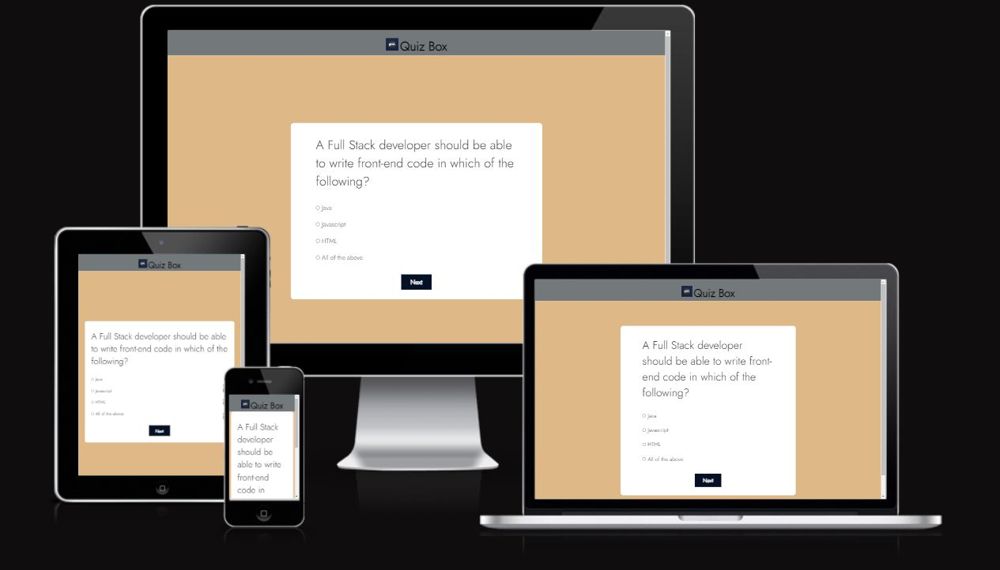

# **Quiz Box**

[Click here to view the live project](https://amrutha2103.github.io/quiz-box/)

Quiz Box is a training platform for programmers where you can improve your skills with fun exercises and test your knowledge with programmer quiz questions.

The quiz provides Multiple Choice Questions (MCQs) and you will have to read all the given answers and click over the correct answer. You can use "Next" button to go to next questions in the quiz.

Interactive quizzes are content where a user answers questions and is then given a specific result or score. The result is based on a calculation of the user's interactions and the answers they provided for each question.

## **Features**

- Header

    * Featured at the top of the page, the header shows the game name: Quiz Box in a font that clearly contrasts with the background.
    * The header is also provided with a logo next to the game name.

