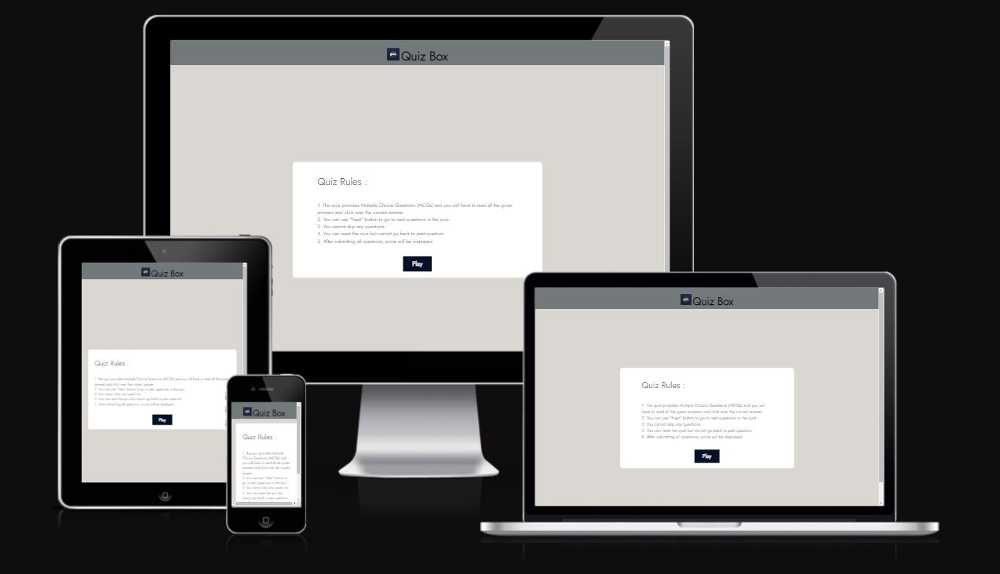
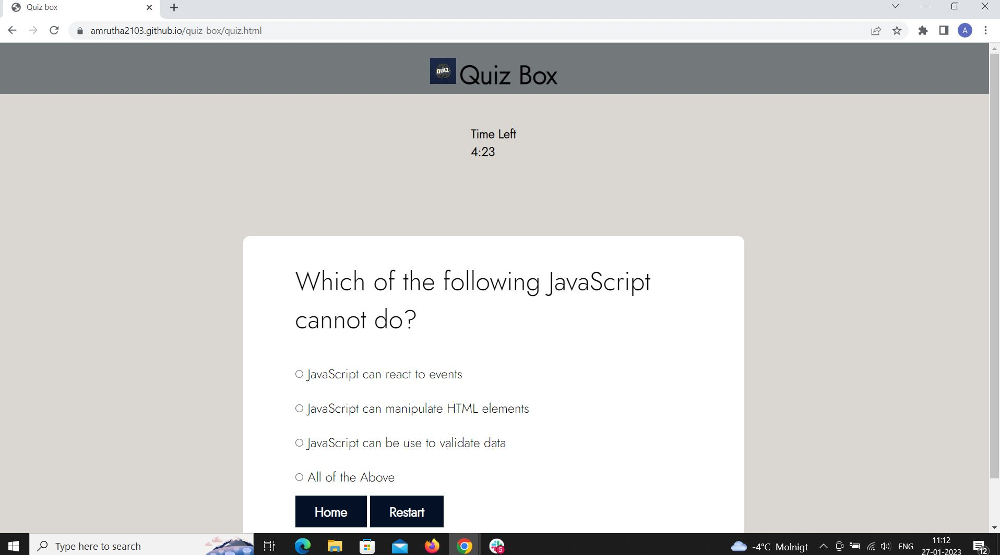
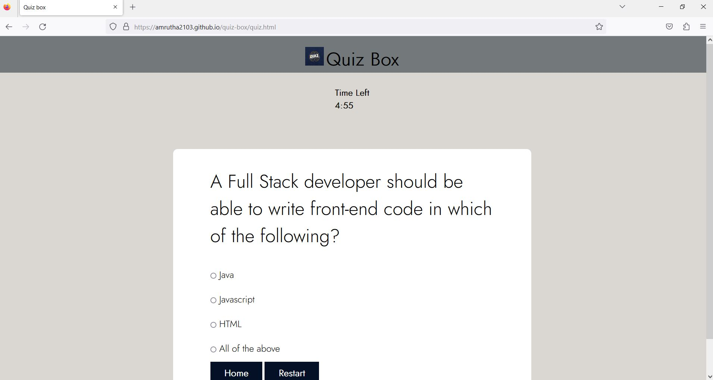
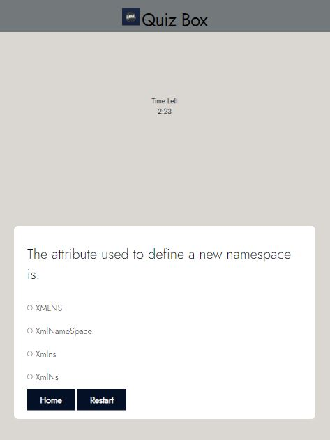

# **Quiz Box**

[Click here to view the live project](https://amrutha2103.github.io/quiz-box/)

Quiz Box is a training platform for programmers where you can improve your skills with fun exercises and test your knowledge with programmer quiz questions.

The quiz provides Multiple Choice Questions (MCQs) and you will have to read all the given answers and click over the correct answer. You can use "Next" button to go to next questions in the quiz.

Interactive quizzes are content where a user answers questions and is then given a specific result or score. The result is based on a calculation of the user's interactions and the answers they provided for each question.

## **Features**

### **Existing Features**

- Header

    * Featured at the top of the page, the header shows the game name: Quiz Box in a font that clearly contrasts with the background.
    * The header is also provided with a logo next to the game name.

- The Game Area

    * The game area provides multiple choice questions.
    * You will have to read all the given answers and click over the correct answer.
    * You can use "Next" button to go to next questions in the quiz.
    

- The Score Area

    * The user answers questions and is then given a specific result or score
    * The Javascript code compares the answer provided by the user with the correct answer.
    * The result is based on a calculation of the user's interactions and the answers they provided for each question.
    * This section provides a "Reload" button that the user can click to reload the quiz and play the game.

### **Features to implement**

- When there is time, I would like to expand this quiz game to include timer within which the quiz has to be completed.
- I would also include an option to go back to the previous questions to edit the answer if the user wishes.

## **Testing**

- I confirmed that the quiz results are always correct.
- I confirmed that the colors, fonts chosen and texts included are readable and easy to understand.
- I confirmed that all the buttons are provided action and redirected to the correct page.

### **Browser Compatibility**

- I tested the website on different browsers like Chrome, Edge and Firefox.

### **Responsiveness**

- I confirmed that the project is responsive and looks good on all standard screen sizes using the devtools device toolbar.

### **Validator Testing** 

- HTML
  * No errors were returned when passing through the official [W3C validator](https://validator.w3.org/nu/?doc=https%3A%2F%2Famrutha2103.github.io%2Fquiz-box%2F).

   

- CSS
  * No errors were found when passing through the official [(Jigsaw) validator](https://jigsaw.w3.org/css-validator/validator?uri=https%3A%2F%2Famrutha2103.github.io%2Fquiz-box%2F&profile=css3svg&usermedium=all&warning=1&vextwarning=&lang=en).

 

- JavaScript
  * No errors were found when passing through the official [JSHint JavaScript Validator](https://jshint.com/)

   

- Accessibility
  * I have checked the accessibility by running it through the lighthouse in devtools.

